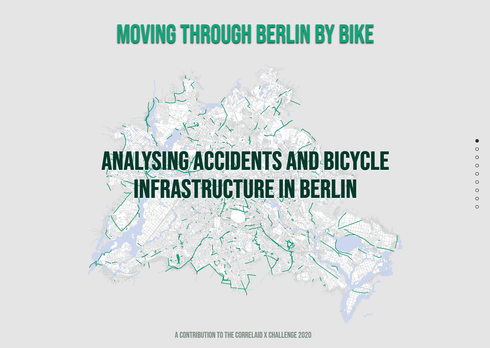
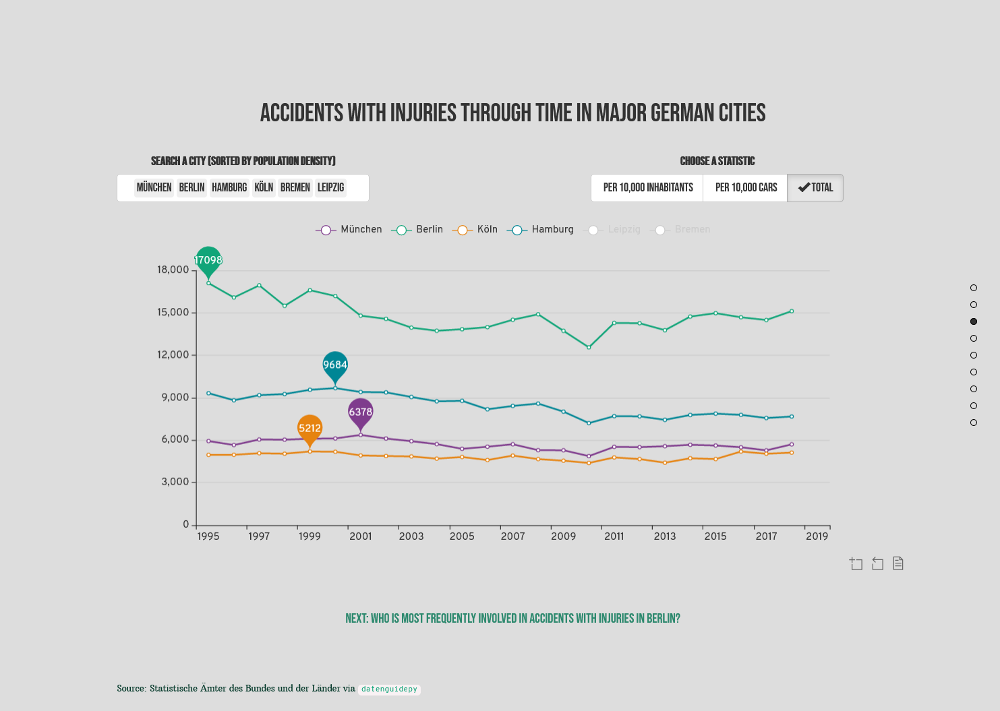
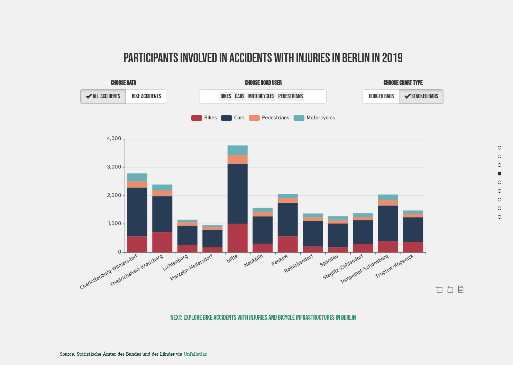
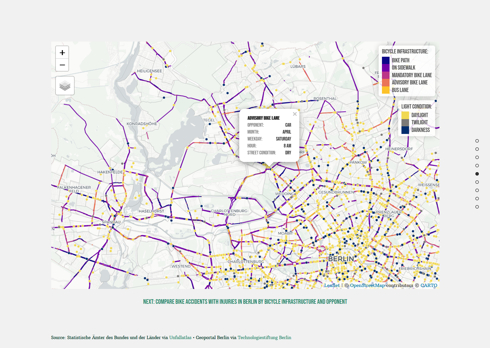
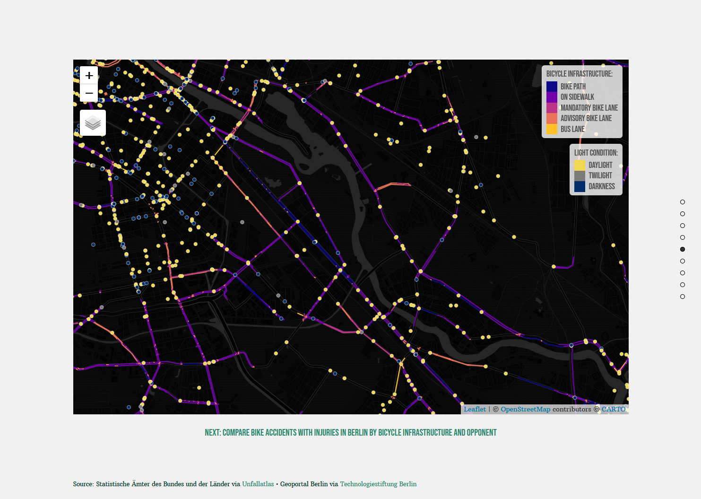
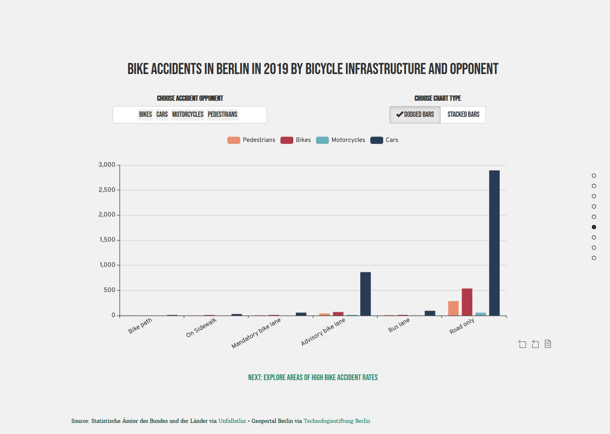
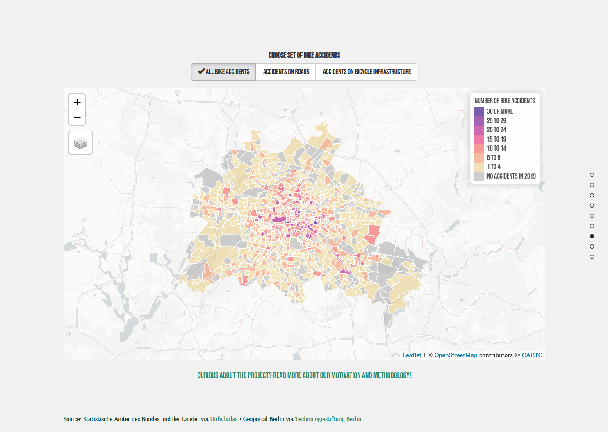
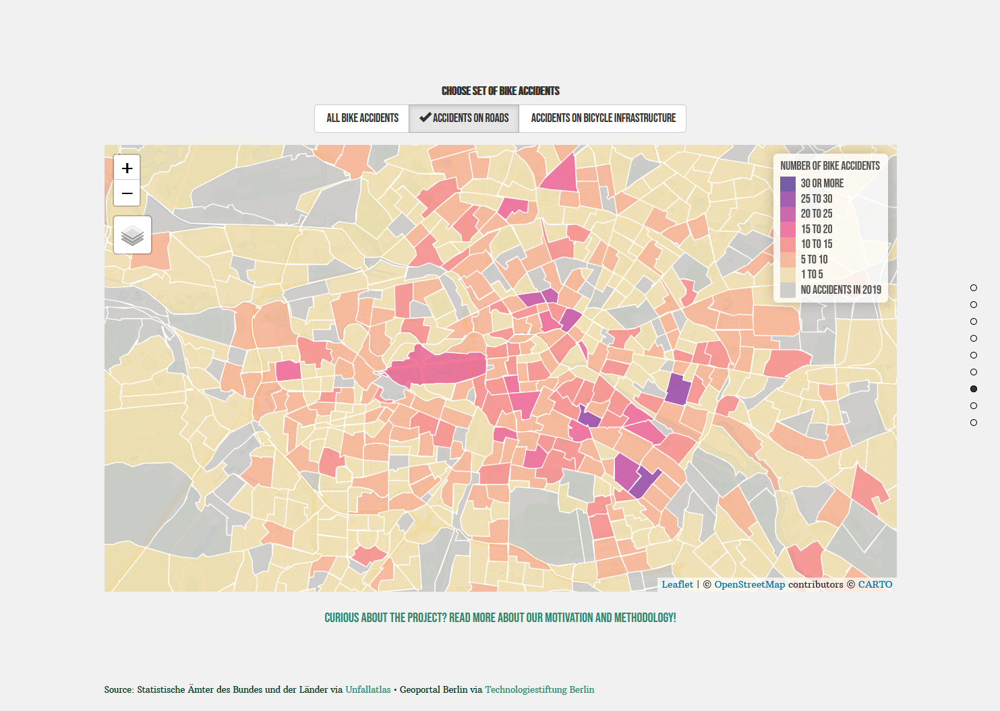
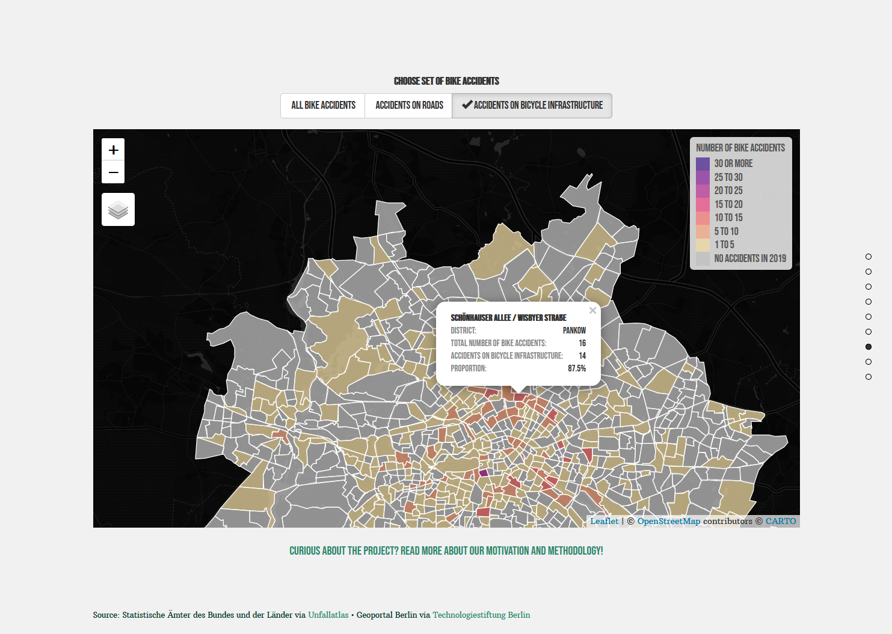

# CorrelAid X Challenge Berlin

A shiny app to explore acidents in Germany as well as bike lane types and bike accidents Berlin.

Created for the CorrelAidX Challenge 2020 *“Analysing and visualising German regional statistics with datenguidepy”* by Cédric Scherer, Andreas Neumann, Saleh Hamed & Steffen Reinhold as contribution by CorrelAidX Berlin.

### View the app online

[Link to shinyapps.io](https://cedric-scherer.shinyapps.io/xberlin/)

(The app might or might not work depending on how many people have recently visited the page. Sorry, we are very limited in memory unfortunately. If the app doesn't load, please try it again at a later point or install the package as explained below.)


### Run the app as package in `R`

In your R console, run the following. Make sure the `{devtools}` package is installed as well (if not, run `install.packages("devtools")`.

```
devtools::install_github("CorrelAid/xberlin")
xberlin::run_app(launch.browser = .rs.invokeShinyWindowExternal)
```

### Previews

#### Slide 1: Title Page



#### Slide 3: Comparison of Accidents with personal injury in Major Cities in Germany





#### Slide 4: Accidents with personal injury in Berlin in 2019 per District and Road User





#### Slide 5: Berlin Map of Bike Accidents with personal injury and Bicycle Infrastructure






#### Slide 6: Bike Accidents with personal injury per Bike Infrastructure and Opponent




#### Slide 7: Berlin Map of Bike Accidents with personal injury per Traffic Cell





#### Slide 9: About the Project


