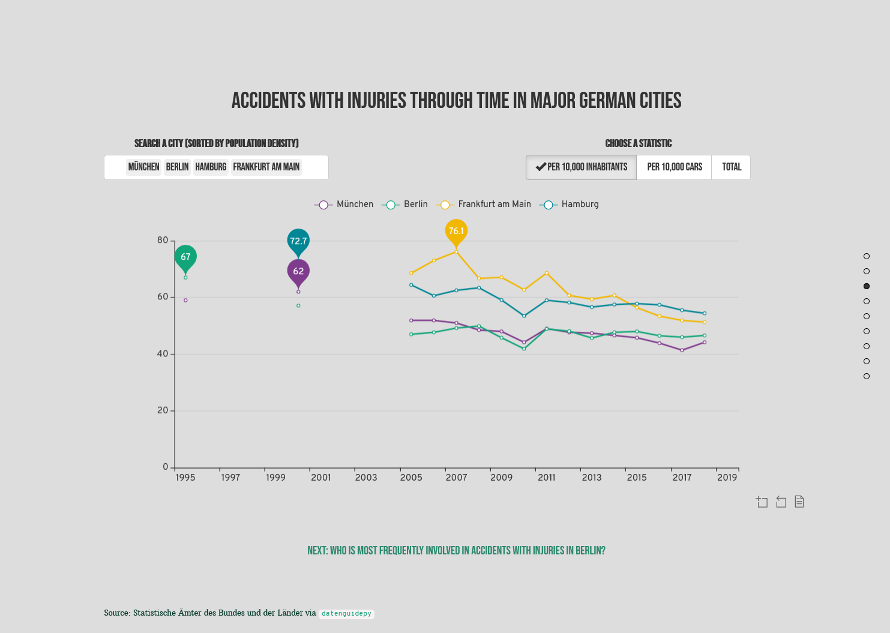
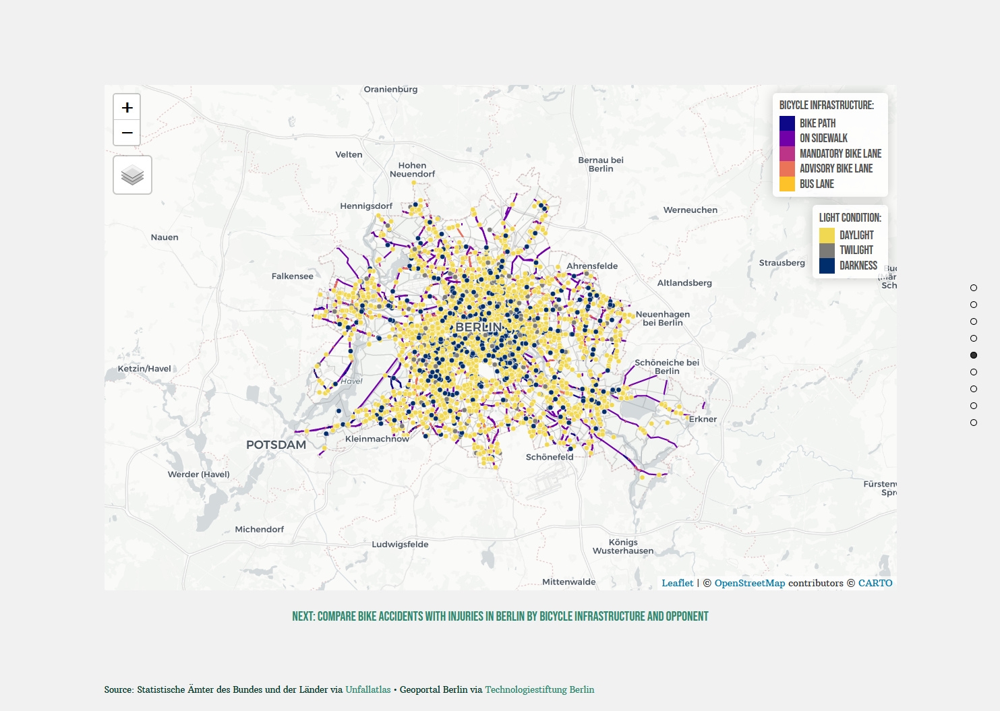
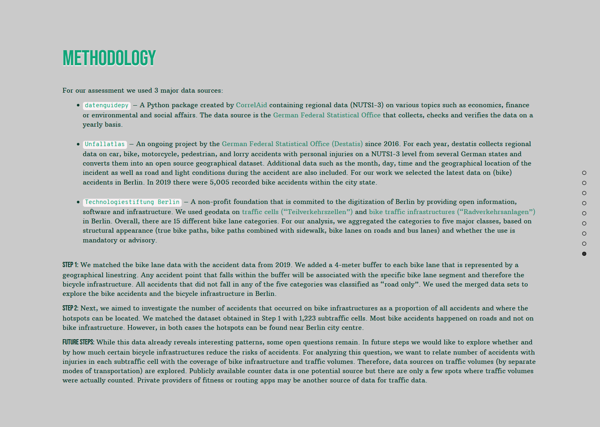

# CorrelAid X Challenge Berlin

A shiny app to explore acidents in Germany as well as bike lane types and bike accidents Berlin.

Created for the CorrelAidX Challenge 2020 *“Analysing and visualising German regional statistics with datenguidepy”* by Cédric Scherer, Andreas Neumann, Saleh Hamed & Steffen Reinhold as contribution by CorrelAidX Berlin.

#

### View the app online

[Link to shinyapps.io](https://cedric-scherer.shinyapps.io/xberlin/)

(The app might or might not work depending on how many people have recently visited the page. Sorry, we are very limited in memory unfortunately. If the app doesn't load, please try it again at a later point or install the package as explained below.)

#

### Run the app as package

In your R console, run the following. Make sure the `{devtools}` package is installed as well (if not, run `install.packages("devtools")`.

```
devtools::install_github("CorrelAid/xberlin")
xberlin::run_app(launch.browser = .rs.invokeShinyWindowExternal)
```

In some trial runs, three non-CRAN packages had to be installed manually. If you have the same problems, please install the GitHub versions with the following code:

```
devtools::install_github("RinteRface/fullPage")
devtools::install_github("JohnCoene/typed")
devtools::install_github("hadley/emo")
```

#

### Run the app locally

1) Clone the repo
2) Open the project (click on the `xberlin.proj` file)
3) Install package dependencies
4) Open the script `app.R`
5) Either run that script or press the `Run App` button in the toolbar

---

### About

Re-thinking mobility is crucial to improve air quality and CO2 consumption in traffic. For this reason, Berlin has set itself the [goal of getting away from a car based concept of mobility](https://www.berlin.de/sen/uvk/verkehr/verkehrsplanung/radverkehr/mobilitaetsgesetz/). Instead, Berlin wants to promote cycling as an environmentally friendly and sustainable mode of transportation.

At the same time, cyclists are the most at-risk group of all traffic participants. According to the accident statistics around a quarter of all accidents involve cyclists. And while accident numbers have generally declined over the last fifteen years in Berlin, they have recently remained rather stable with little improvements. In contrast, accident numbers have continued falling In other large German cities. The data also reveals that most bike accidents happen on roads without any sort of bike lane or on advisory bike lane paths. In around 80% of these accidents cars are involved putting cyclists at serious risk of getting injured or even killed.

While many people want to switch to cycling, safety concerns are deterring many people from using bikes more often. Perceived and actual risk of biking is a [key determinant in mobility decisions](https://nationaler-radverkehrsplan.de/de/forschung/schwerpunktthemen/subjektive-sicherheit-im-radverkehr). The importance ofthese risk considerations can be seen during the Corona epidemic when commuters [have switched from public transit](https://www.adac.de/verkehr/standpunkte-studien/mobilitaets-trends/corona-mobilitaet/) (where infection seems more likely) to [cars](https://www.handelsblatt.com/unternehmen/industrie/mobilitaet-zurueck-zum-individualverkehr-in-der-krise-waechst-die-lust-am-eigenen-auto/25799626.html) and [bicycles](https://www.zeit.de/mobilitaet/2020-09/radfahrer-coronavirus-fahrrad-boom-staedte-zahlen-verkehr). To get people on the bike, safety has therefore to be improved. The recent change in mobility patters during the Corona epidemic has further increased the need to improve bike safety. But first, we need to understand where and why cyclists are at risk of having accidents.

Using publicly available data on accidents with injuries from the [German Federal Statistical Office](ttps://www.destatis.de/EN/Home/_node.html) — provided by the [`datenguidepy`](https://datenguidepy.readthedocs.io/en/latest/readme/) wrapper and the [“Unfallatlas”](https://unfallatlas.statistikportal.de/_opendata2020.html) — as well as information on [bicycle infrastructure](https://data.technologiestiftung-berlin.de/dataset/radverkehrsanlagen) and traffic cells(https://data.technologiestiftung-berlin.de/dataset/teil_verkehrszellen), the relevant areal unit for data collection and planning in Berlin, these questions are explored on the following pages. 

---

### Previews

#### Slide 1: Title Page


#### Slide 3: Comparison of Accidents with Injuries in Major Cities in Germany





#### Slide 4: Accidents with Injuries in Berlin in 2019 per District and Road User


#### Slide 5: Berlin Map of Bike Accidents with Injuries and Bicycle Infrastructure




#### Slide 6: Bike Accidents with Injuries per Bike Infrastructure and Opponent


#### Slide 7: Berlin Map of Bike Accidents with Injuries per Traffic Cell


#### Slide 8: About the Project


#### Slide 9: Methodology & Future Steps


